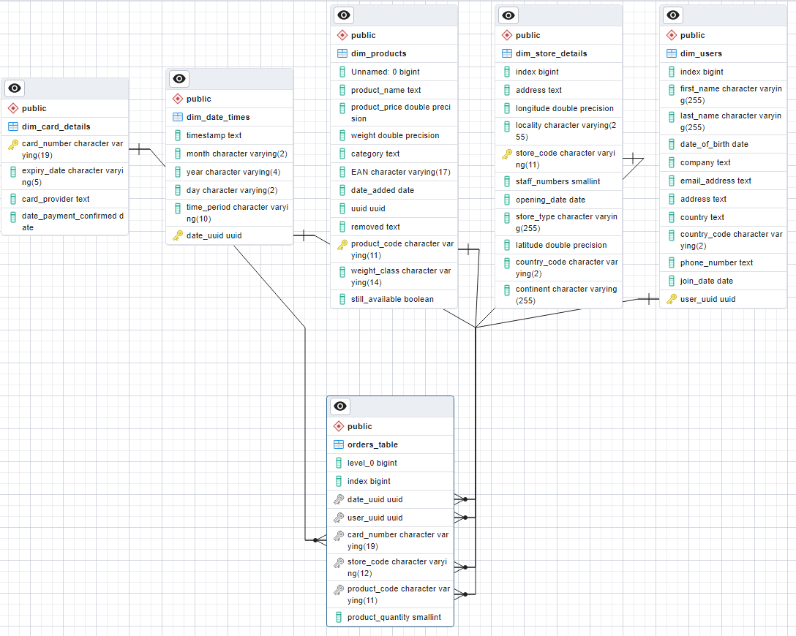

## multinational-retail-data-centralisation9

# Overview
This  project is aimed at transforming and analysing large datasets from multiple data sources.

# Details of the work done

- Developed a system that extracts retail sales data from five different datasources; PDF documents; an AWS RDS database; RESTful API, JSON and CSV files.
- Created a Python class which cleans and transforms over 120k rows of data before being loaded into a Postgres database.
- Developed a star-schema database, joining 5 dimension tables to make the data easily queryable allowing for sub-millisecond data analysis
- Used complex SQL queries to derive insights and to help reduce costs by 15%
- Queried the data using SQL to extract insights from the data; such as velocity of sales; yearly revenue and regions with the most sales.

# Database Schema
